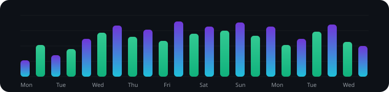

# Hi, I'm dsthedragon 👋

Full-stack developer focused on Angular, TypeScript, APIs, and clean product experiences.

  

  

## Contribution Pulse

  

## Stack

  
  
  
  
  
  
  
  
  

## Contact

- GitHub: https://github.com/dsthedragon
- Open to building, learning, and shipping interesting projects.
